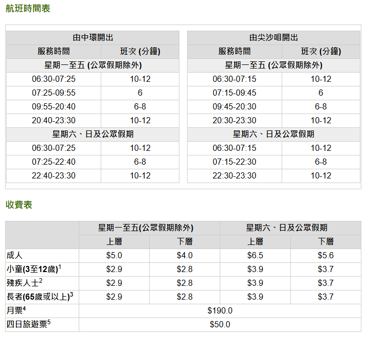
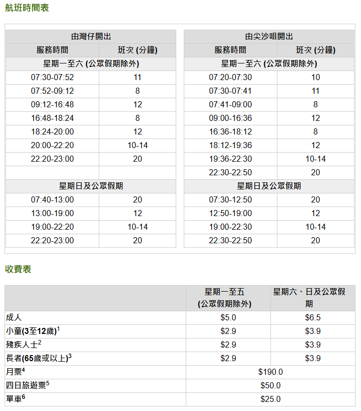

<h1 align=center>HK+MO Tour Plan</h1>

# Day1

- 12:26-13:38 深圳坪山-香港西九龙
- 14:30 *地铁*：屯马线乌沙溪方向，柯士甸->尖东，酒店寄存行李
- 15:00 *步行*：万宁(K11 Mall店)购物，药品，再回酒店入住
- 16:00 *步行*：海港城、[尖沙咀天星码头](https://www.starferry.com.hk/tc/service)
  
<image src="doc\map.jpg" width="600"; height="450">

  
航线图

  

    <figure style="margin-right: 10px; text-align: center;">
      
    <figcaption>中环-尖沙咀</figcaption>
    </figure>
    <figure style="text-align: center;">
      
      <figcaption>湾仔-尖沙咀</figcaption>
    </figure>
  

- 16:30 *天星小轮*：[中环摩天轮](https://hkow.hk/zh-hans/ticket-info/)
  
<image src="doc\price3.PNG">

- 17:30 *叮叮车*：
